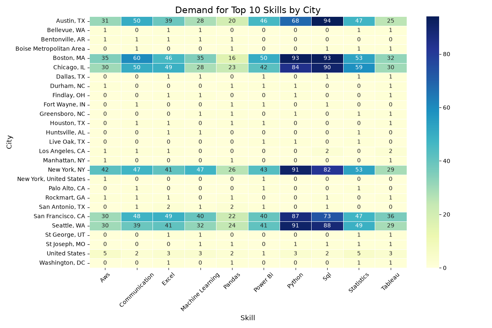

# LinkedIn Job Trend Analysis

## Objective
Extract real-world job postings to analyze skill demand trends across major cities and professional roles, providing actionable insights for job seekers and career planners.

## Dataset
`linkedin_jobs_data.csv` - Contains parsed web data including job titles, required skill tags, and geographic locations.

## Tools Used
* Python
* BeautifulSoup (Web Scraping)
* Pandas & NumPy (Data Processing)
* Matplotlib & Seaborn (Visualization)
* Microsoft Excel

## Project Features
* Automated extraction of unstructured job data from the web.
* Natural Language Processing for standardizing and cleaning skill tags.
* Geographic Heatmap Generation for the Top 10 requested skills.
* Skill vs. Role Cross-tabulation Matrix for career mapping.

## Key Insights
* Foundational tools like Data Analysis and Python are universally demanded across modern tech and business roles.
* Specific cities show highly concentrated, localized demands for specialized skill sets.
* Standardized text parsing reveals significant overlaps in required skills between adjacent career paths.
* Heatmaps intuitively highlight exactly where job seekers should focus their upskilling efforts based on geographic location.

## Outcome
Created a comprehensive analytical pipeline that transforms unstructured web data into interactive matrices and striking heatmaps. The final deliverables offer a clear, quantifiable roadmap for navigating the modern employment market.

---

## Dashboard / Project Preview *(Optional but HIGHLY RECOMMENDED)*

```markdown

```

---

## Files Included
* Main Project File (`Job_Trend_Analysis.ipynb`)
* Project Documentation (`LinkedIn_Job_Trends_Project_Documentation.pdf`)
* Visual Heatmap (`Top_10_Skills_Heatmap.png`)
* Visual Matrix (`Skill_Role_Matrix.png`)
* Exported Matrix Dataset (`Skill_Role_Matrix.xlsx`)
* Raw Dataset (`linkedin_jobs_data.csv`)
* README File (`README.md`)
